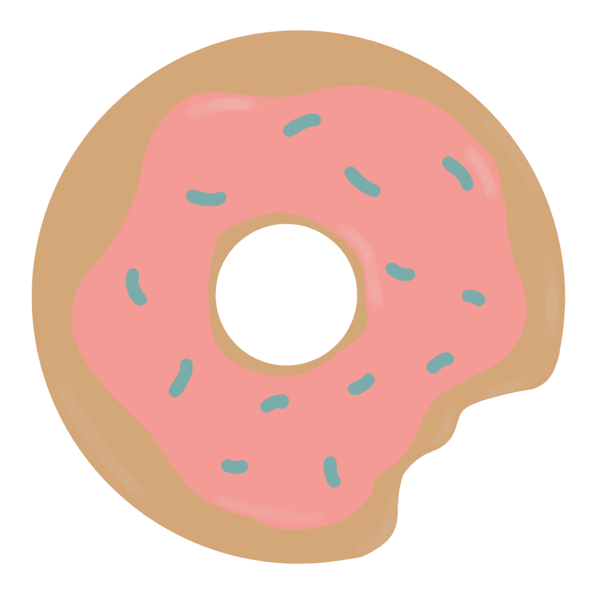

# copycake

## About this app

### This app is made in Symfony 5 on REST API.

Used technologies into projects: 
 - Redis
 - MySQL 
 - RabbitMQ
 - NGINX

This project I created with:
  - SOLID
  - DDD
  - TDD
  - KISS
  - CQRS
  - DRY

Copy Cake App was created for my girlfriend who is a copywriter. The app allows users to manage their tasks in an easy way.

Copywiters can add all of tasks that have been commissioned by their clients.
The application automatically calculates the price of the task based on the number of characters in each text written by the copywriter.
In addition, the tool generates a simple report for a specific period that can be presented to customers in PDF format.

### Docker

change <b>.env.example</b> on <b>.env</b> and fill in the missing field

To run app in docker:

    docker-compose up -d

To get into php container:

    docker exec -it php-fpm /bin/bash

Install all libraries:

    composer install

Create jwt hash:

    openssl genrsa -out config/jwt/private.pem -aes256 4096
      
    openssl rsa -pubout -in config/jwt/private.pem -out config/jwt/public.pem

For testing app in docker run:

    ./vendor/bin/phpunit